# OnlineJudge

  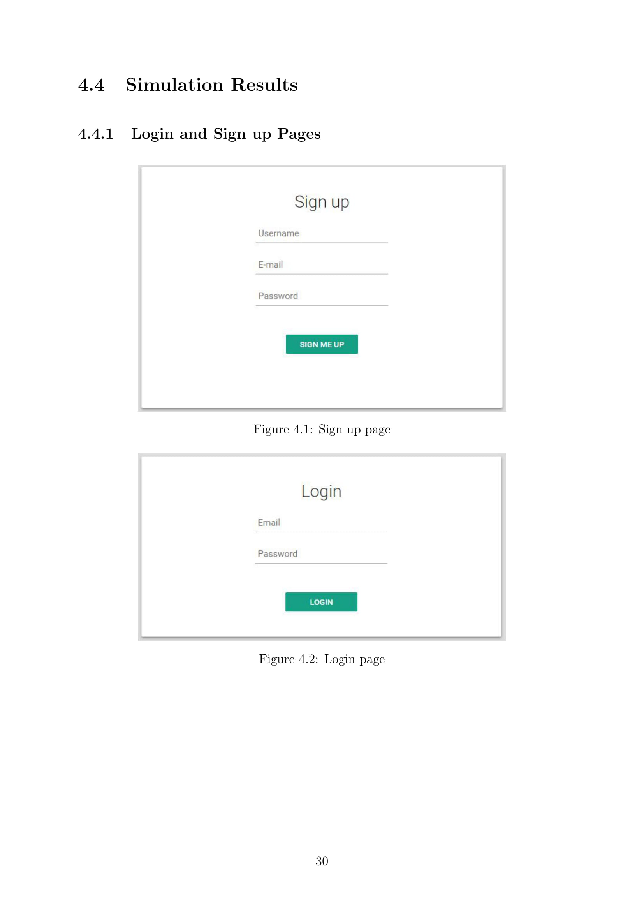
  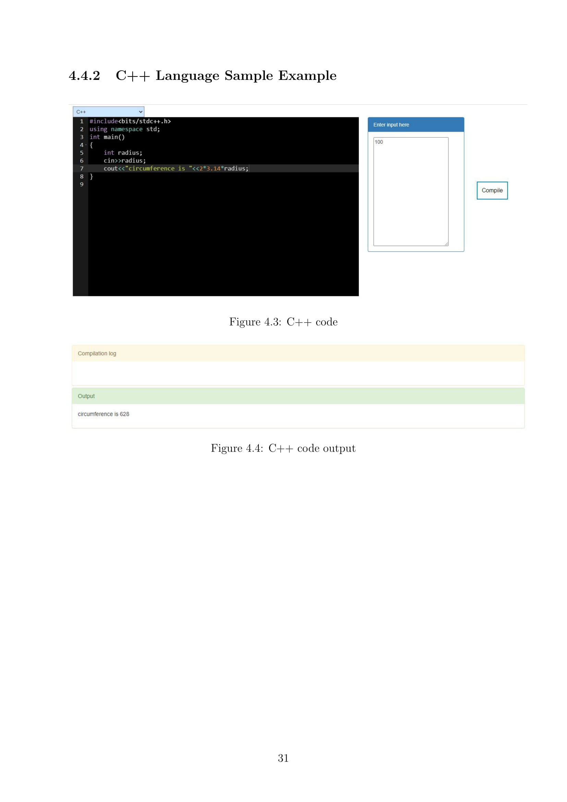
  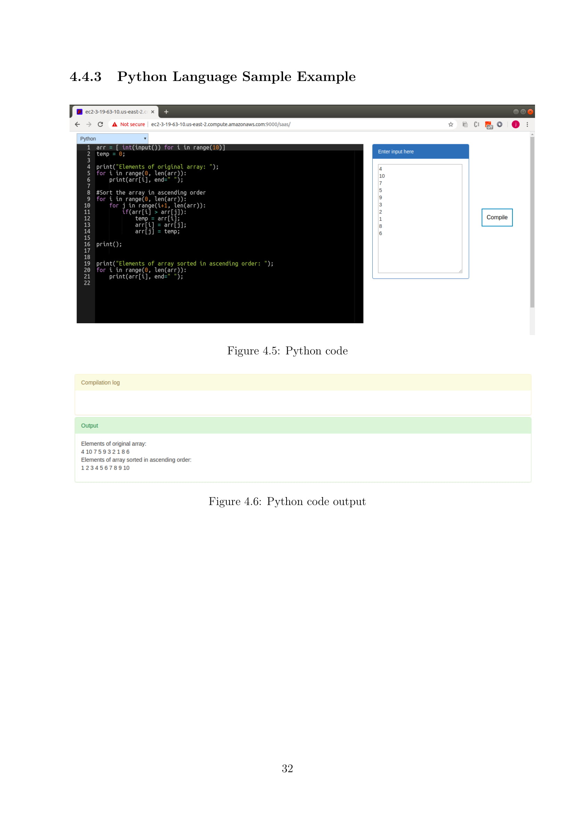
  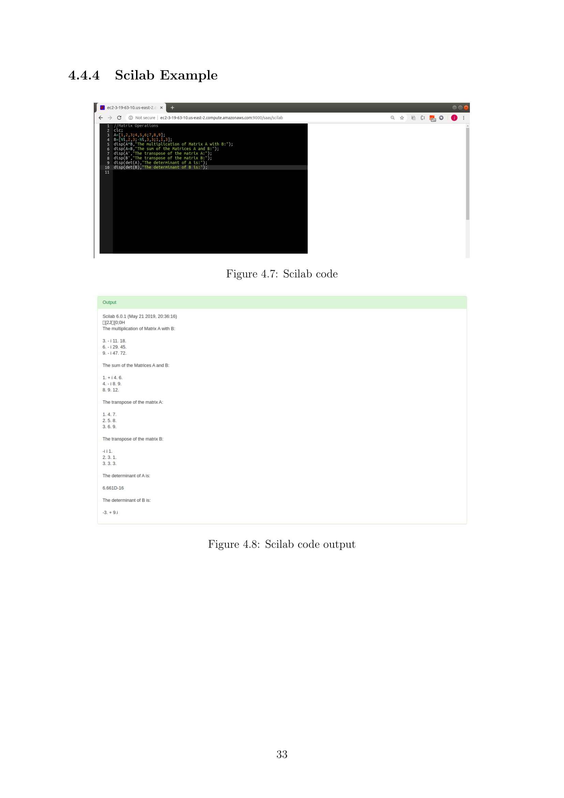
  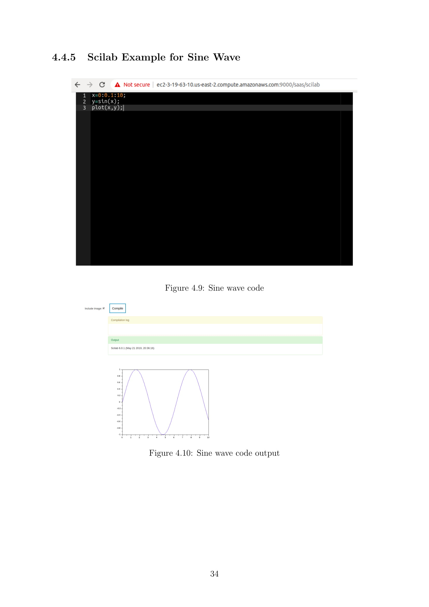
  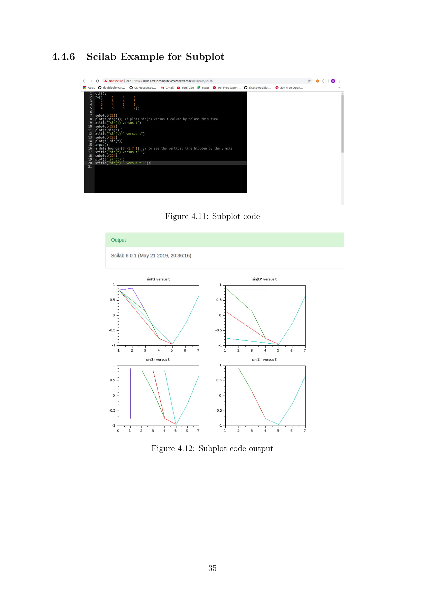
  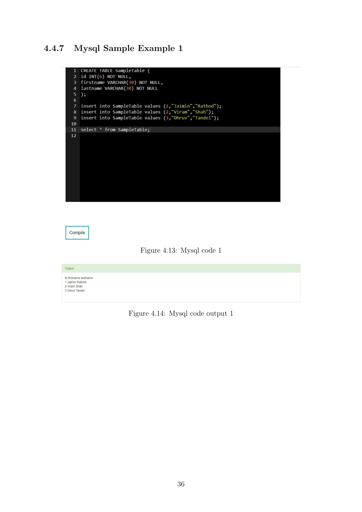
  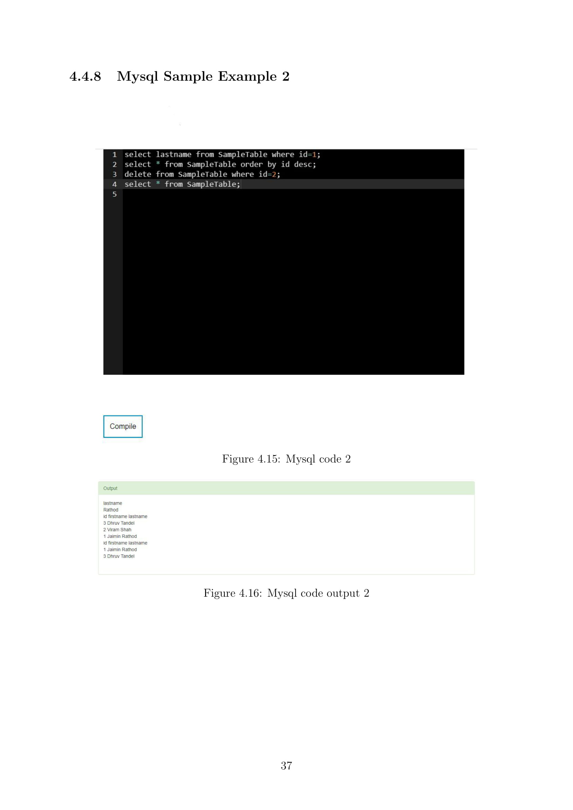
  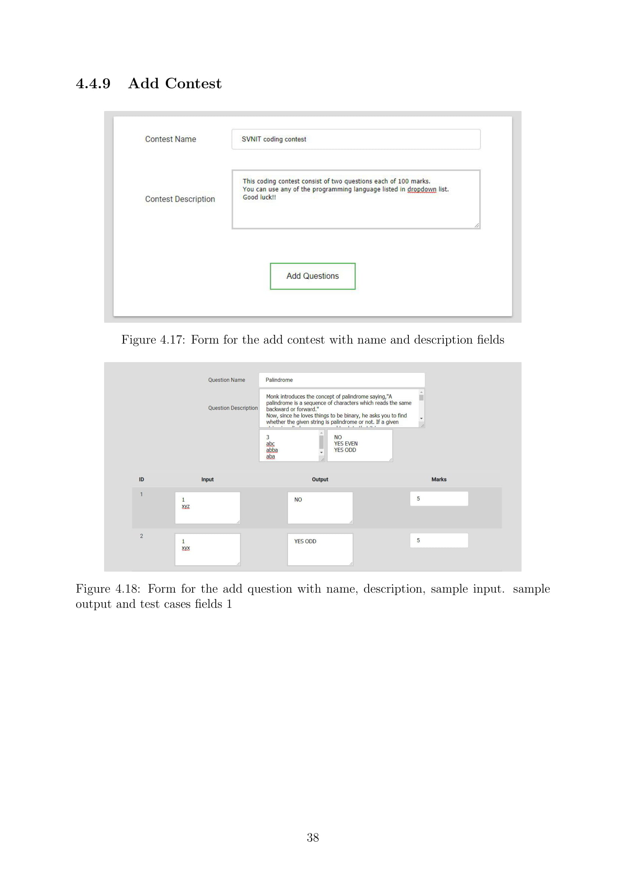
  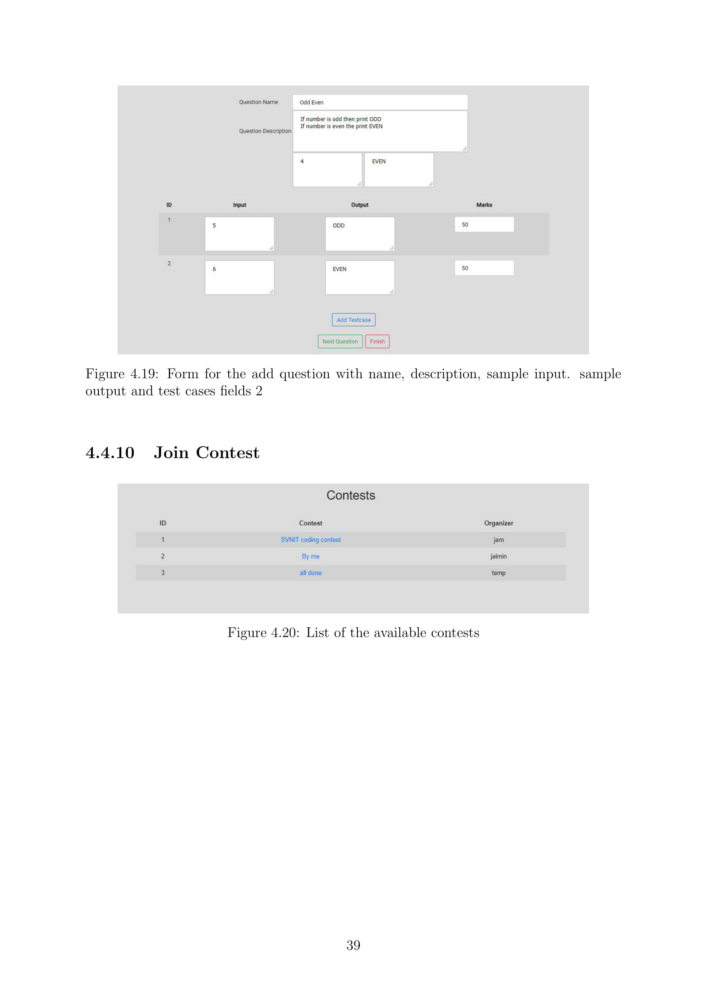
  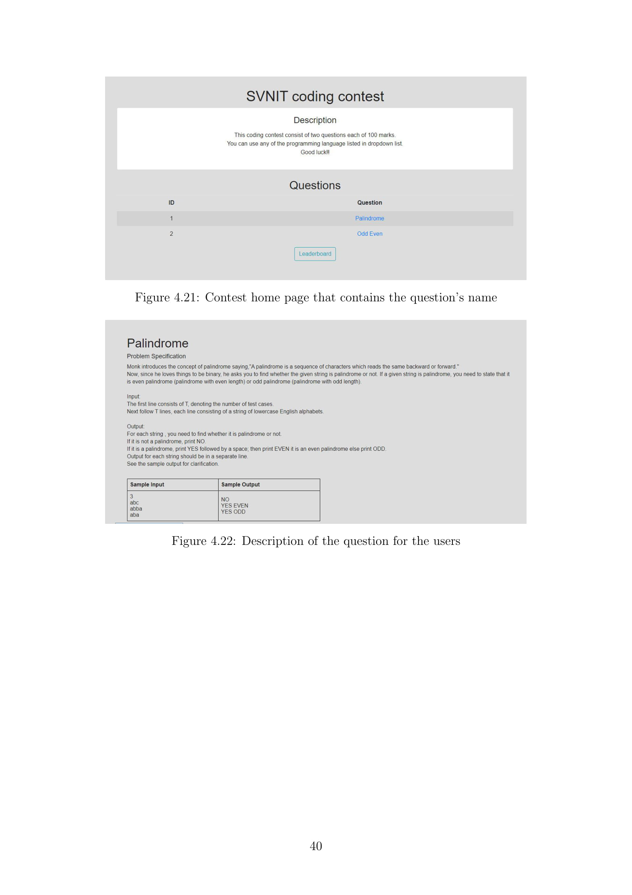
  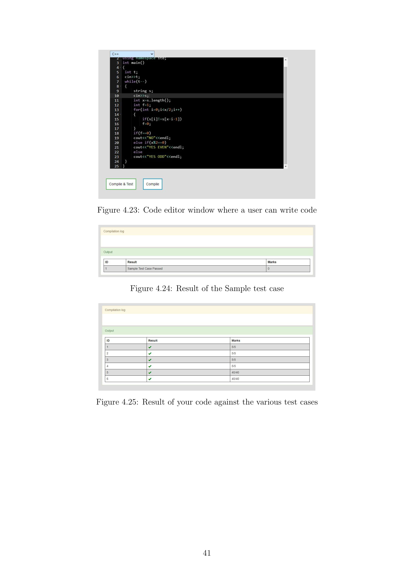
  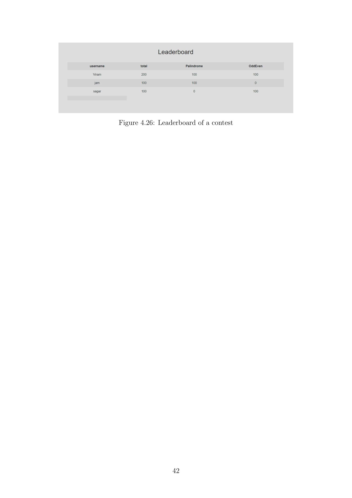

->Simulation and Results :-
https://drive.google.com/file/d/1i-YDERZqEMl2onS6yfs1Y8IpxSB_bU8U/view?usp=sharing

The application is based on providing software delivery using internet platform.The
application is a Docker based sandbox to run code and return the output to your app.
Users can submit their code in any of the supported languages. The system will test the
code in an cloud based virtual environment and give results accordingly.

-> How does it work ?
The client-side app submits the code in supported language , , it can be scilab code or
mysql query. User can provide input simultaneously with code . The REST API transfers
the code to server. Here shared memory access is provided between docker and server.
Code is compiled using shell script and response is send back to client-side. Response
can be output or error.

-> Technology road-map for an application

• Technology for cloud platform setup

Different services of Amazon web services(AWS) is used for implementing IaaS
like Elastic Compute Cloud (EC2)(for creating virtual machine),Amazon Simple
Storage Service (S3) (for simple storage service)

• Technology for integrating software
Docker is used to provide container service for running different language code in
container and give back result to REST API call.

• Technology for back-end server
For receiving request from client side and connection between virtual machine and
docker we need to configure apache server.Java(Spring Boot) is used for development
of web services and REST API.

• Technology for client side development
In order to provide interface to cloud based compiler HTML,CSS,Javascript,jQuery
and Angular Js is used.

